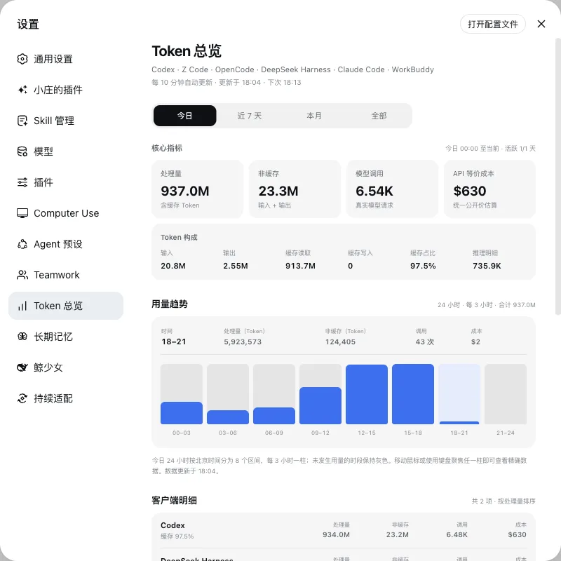

# dsh-token-overview

[English](README.en.md) | 中文

  

统一查看整台电脑上多个 AI 客户端的 Token、缓存、调用、活跃时段和预估成本。

Token 总览设置页复用产品统一标题层级；安装到尚未提供该共享组件的旧版 DSH 时会使用同尺寸的内置兼容标题。

## 安装

1. 打开 [Releases](https://github.com/niushuanan/dsh-token-overview/releases/latest)，下载附带的 ZIP。
2. 把 ZIP 交给能够读取并修改目标 DSH 项目的 AI。
3. 对 AI 说：**先阅读压缩包里的 AGENTS.md、INSTALL.md 和 manifest.json，只安装这个插件，并保留现有插件、数据、对话、附件和设置。**
4. 安装 AI 会按目标 DSH 的当前结构合入代码和 Cordis 行，只验证本插件直接涉及的入口。

## 运行要求

- 安装 AI 需要把 `support/tokscale-token-report` 复制到 `~/.codex/skills/tokscale-token-report`；仓库不包含本机报告、历史锁或价格缓存。

## 内容

- <code>payload/</code>：从主仓库复制的插件代码和必要运行资源。
- <code>manifest.json</code>：插件组成、来源、主仓库 commit 和逐文件 SHA-256。
- <code>INSTALL.md</code>：直接安装、冲突适配、失败恢复和最小验证说明。
- <code>docs/</code>：当前版本的真实产品截图。

## 来源与许可

本仓库是 [Xiaozhuang DSH](https://github.com/niushuanan/xiaozhuang-dsh) 的单向发布副本，不是独立开发源。当前内容同步自主仓库 commit [`e4845a8168`](https://github.com/niushuanan/xiaozhuang-dsh/commit/e4845a81688efec24ecff6d9c61dfbe1b8194776)，最近正式发布版本仍为 [`xiaozhuang-v0.4.2`](https://github.com/niushuanan/dsh-token-overview/releases/tag/xiaozhuang-v0.4.2)。代码采用 [MIT License](LICENSE)。
